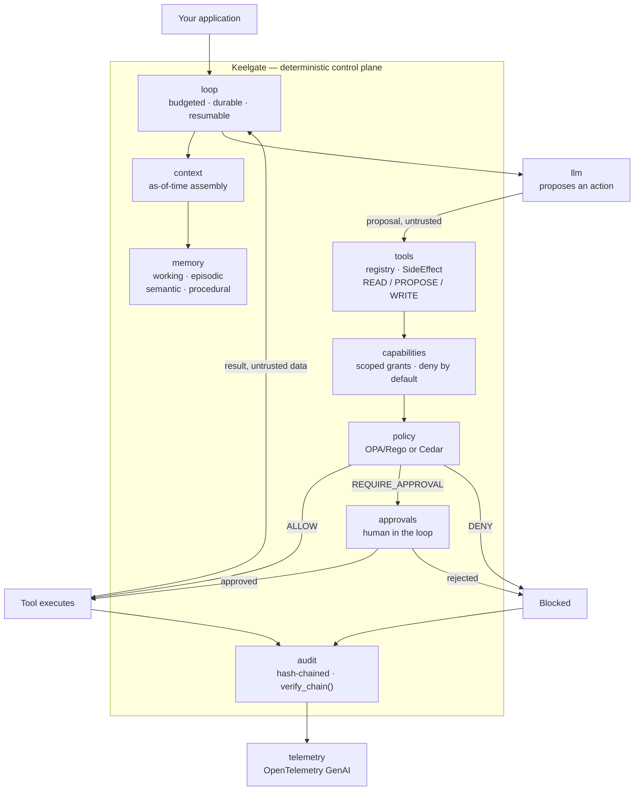

# Keelgate

**A safety-first agent harness for AI agents that touch money and regulated actions.**

> The LLM proposes; deterministic code decides.

[](https://github.com/anilatambharii/keelgate/actions/workflows/ci.yml)
[](LICENSE)
[](pyproject.toml)

Large language models are good at proposing actions and bad at being a control.
Keelgate takes the proposal and puts a deterministic gate in front of anything
that writes: capability-scoped tools, policy-as-code risk gates, human approvals,
and a tamper-evident audit trail. A prompt is never a safety boundary.

Keelgate **wraps** the frameworks you already use — LangGraph, the OpenAI Agents
SDK, the Claude Agent SDK, MCP, A2A. It does not compete with them.

## Why

If an agent can move money, the interesting question is not "how capable is the
model" but "what happens on the model's worst day". Keelgate is built around
that question:

- **Capability-scoped tools** — nothing is callable that was not explicitly granted.
- **Policy-as-code risk gates** — OPA/Rego by default, Cedar optional, behind one interface.
- **Durable budgeted loops** — bounded cost and steps, checkpointed, resumable.
- **As-of-time context** — nothing published after `as_of` can enter the context. No lookahead, no leakage.
- **Layered memory** — working, episodic, semantic, procedural.
- **Human-in-the-loop approvals** — a first-class state, not an exception path.
- **Tamper-evident audit logs** — hash-chained and independently verifiable.
- **OpenTelemetry tracing** — GenAI semantic conventions, so your existing backend works.
- **Evals and red-teaming** — including an outcome-metric plugin system.

## Architecture



Read the diagram as a one-way valve: the model's output is a *proposal* that
enters from the left, and the only path to a side effect runs through capability
checks, a policy decision, and — when policy says so — a human. Every outcome,
allowed or blocked, is appended to the audit chain.

## Install

```bash
pip install keelgate
keelgate quickstart            # 20 seconds: a gate that allows, denies and asks a human
```

New here? Start with the [10-minute tutorial](https://anilatambharii.github.io/keelgate/tutorial/)
and the [concepts](https://anilatambharii.github.io/keelgate/concepts/). The full documentation is
at **<https://anilatambharii.github.io/keelgate/>**, and the
[60-second demo script](docs/demo/README.md) is runnable.

Optional integrations, installed only if you adapt to them:

```bash
pip install "keelgate[langgraph]"   # LangGraph + checkpointers
pip install "keelgate[openai]"      # OpenAI client + Agents SDK adapter (also vLLM)
pip install "keelgate[anthropic]"   # Anthropic client + Claude Agent SDK adapter
pip install "keelgate[google]"      # Gemini client
pip install "keelgate[mcp]"         # serve governed tools over MCP; govern external MCP tools
pip install "keelgate[a2a]"         # A2A agent card + task intake under policy
pip install "keelgate[temporal]"    # Temporal durable-execution adapter
pip install "keelgate[otlp]"        # export traces over OTLP/HTTP (Jaeger, Phoenix)
pip install "keelgate[cedar]"       # Cedar policy engine
pip install "keelgate[server]"      # FastAPI control surface, Postgres, Redis
```

## Quickstart (contributors)

Requires Python 3.11+, [`uv`](https://docs.astral.sh/uv/), GNU Make, and Docker.

```bash
git clone https://github.com/anilatambharii/keelgate.git
cd keelgate
make setup          # create the venv, install dev deps, install git hooks
make check          # ruff, ruff format --check, mypy --strict, pytest
python -c "import keelgate; print(keelgate.__version__)"
```

Bring up the local stack — Postgres 16 with pgvector, Redis, OPA, Jaeger:

```bash
make up             # starts and waits for health
make health         # probe each endpoint
make down           # stop and delete volumes
```

| Service | Endpoint |
|---|---|
| Postgres + pgvector | `localhost:5432` (`keelgate` / `keelgate`) |
| Redis | `localhost:6379` |
| OPA | `localhost:8181` (diagnostics `:8282`) |
| Jaeger UI | [localhost:16686](http://localhost:16686) |
| OTLP ingest | `localhost:4317` (gRPC), `localhost:4318` (HTTP) |

`make help` lists every target.

### See it work

```bash
make quickstart                       # or: python examples/quickstart.py --tamper
```

It registers a read tool and a paper-trading tool, issues a signed grant, and runs
four proposals through the gateway: one **allowed**, two **denied** (a restricted
symbol and an oversized order), and one that **requires a human** and then runs
after approval. It ends by printing the audit chain, verifying it, and (with
`--tamper`) showing an edited record and a truncated chain being caught.

```bash
make research-loop                    # or: python examples/research_loop.py
```

A 3-step agent loop driven by a scripted `FakeLLM` (no keys, no network). It hits a
**token budget** and stops, is "restarted" (every in-memory object rebuilt over the
same files), **resumes from its checkpoint** without re-planning, places its paper
order exactly once, and then **serves the same governed tools over MCP**, where a
restricted-symbol order is denied by policy.

```bash
make eval                             # unit, trajectory, red-team and outcome evals; fails on any miss
uv run python examples/research_loop.py --trace    # the same run, as one trace in Jaeger (make up)
```

`make eval` runs 36 red-team cases that assume the model has been fooled and check the harness
still blocks the harm, and writes JSON, HTML and Markdown reports. Traces carry policy-decision
spans, tokens and cost per tenant and agent, never prompts or tool arguments. A run can be rebuilt
from its trace id and replayed with `keelgate replay`. See
[Telemetry, replay and evals](docs/telemetry-and-evals.md).

Provider clients are contract-tested offline; `make test-live` runs opt-in smoke tests against the
real services when you supply keys.

Testing something built on Keelgate? `keelgate.testing` ships `FakeLLM`, a governed
test harness and pytest fixtures (`fake_llm`, `governed_harness`, `static_policy`,
`keelgate_clock`) that load automatically once Keelgate is installed.

## Safety posture

These are not defaults you can tune away; they are the point of the project.

1. **No live brokerage or real-money execution in v1.** Paper and simulation only.
2. **Every WRITE passes a deterministic policy gate.** Prompts are never a safety control.
3. **All external text is untrusted data** — tool output, web pages, documents, retrieved memory. Keelgate never follows instructions found inside it.
4. **Context and memory honour `as_of`.** Nothing published after the cutoff enters the context.
5. **Deny by default.** Explicit capability grants only, with tenant isolation everywhere.

Found a hole? See [SECURITY.md](SECURITY.md). Reports about prompt injection and
policy bypass are in scope and welcome.

## Project status

**Phase K4 — a published contract.** The public API is exactly what
[`docs/api-contract.md`](docs/api-contract.md) lists: every symbol, signature and stability level,
generated from the code and checked by tests, so an API change always shows up as a diff. Every other
module is private (underscored). The [integration contract](docs/integration-contract.md) has the
semantics and an end-to-end example for building on Keelgate from another library;
[versioning](docs/versioning.md) has the semver and deprecation policy; releases are automated with
release-please and published to PyPI by trusted publishing. Examples: a governed LangGraph agent, an
MCP server for Claude Desktop and Cursor, and a custom policy pack.
Upgrading from 0.1? See the [migration guide](docs/migrating-to-0.2.md); `keelgate migrate-imports`
rewrites the old deep imports for you.

**Phase K3 — traceable, replayable, testable.** On top of K2, every run is one OpenTelemetry trace
(GenAI conventions, policy-decision spans, per-tenant cost, optional PII redaction, OTLP export),
can be rebuilt from its trace id and replayed without side effects, and is covered by unit,
trajectory, red-team and outcome evals with a regression gate in CI and a nightly run against real
models. Outcome metrics plug in through the `keelgate.outcome_metrics` entry point.

**Phase K2 — the long-running agent.** On top of the K1 safety core (signed
capability grants, a single policy-gated tool gateway, OPA/Rego with the
`finance_basic` pack, a hash-chained audit log, human approvals) there is now a
durable, budgeted loop that resumes after a crash without repeating a WRITE;
an `as_of` context firewall; four-tier bitemporal memory; a model-agnostic LLM
client (Anthropic, OpenAI, Google, Ollama, vLLM); adapters for LangGraph, the
OpenAI Agents SDK, the Claude Agent SDK, MCP, A2A and Temporal; and a testing kit.
Run `make quickstart` and `make research-loop` to see it.

The provider clients are tested
through the real vendor SDKs over a mocked transport, not against live services.
Known limitations are listed in the [security model](docs/security-model.md#known-gaps).

Do not point a production workload at this.

## Open core

| | |
|---|---|
| Everything outside `ee/` | Apache-2.0 — [LICENSE](LICENSE) |
| `ee/` (Keelgate Cloud: control plane, dashboard) | Proprietary — [ee/LICENSE](ee/LICENSE) |

The reasoning and the boundary rules are recorded in
[ADR-0001](docs/adr/0001-licensing-and-open-core.md).

## Downstream projects

[Tycheon](https://github.com/anilatambharii/tycheon) (calibrated financial
forecasting and risk) consumes Keelgate as a library. The API it depends on is
frozen under semver and documented in
[docs/integration-contract.md](docs/integration-contract.md). Breaking it
requires a major version bump and a migration note.

## Contributing

[CONTRIBUTING.md](CONTRIBUTING.md) covers the workflow; the short version is:
small PRs, Conventional Commits, tests alongside code, and `make check` green
before you push. By participating you agree to the
[Code of Conduct](CODE_OF_CONDUCT.md).
