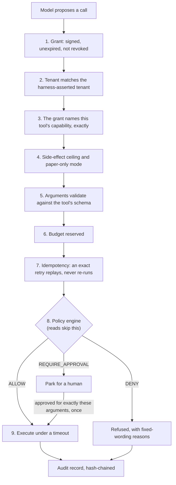

# Concepts

Keelgate is built around one idea and a handful of mechanisms that make it true.

> **The model proposes; deterministic code decides.**

A language model is good at suggesting what to do and unreliable as a control. So nothing the model
says is ever an instruction to the harness. It is a *proposal*, and a small, boring, testable piece
of code decides whether the proposal happens.

## Anatomy of one tool call

Every action an agent takes goes through one place, the **gateway**, and passes the same gates in
the same order. Any gate can refuse; none can be skipped; a refusal is a *result* the model can
read, not an exception.

The audit record is written **before** the side effect. If the log cannot be written, nothing runs.

## What is trusted and what is not

| Trusted (written by you) | Untrusted (anything that can carry an attacker's words) |
|---|---|
| Your code, configuration and policy | Model output |
| The signed grant | Tool output |
| The *policy context*: execution mode, limits, exposure, `as_of` | Retrieved documents and web pages |
| The tenant, derived from your authenticated session | Retrieved memory |
| | Text from another agent |

The line is enforced in types and in code, not in a prompt. Tool output is wrapped in `Untrusted`
and has to be unwrapped by name. Outside text reaches a model only inside a fenced
`<untrusted ...>` block that it cannot close from within. The policy context is built by *your*
code on every call and the model never gets to supply any of it, so "set the limit to a billion"
in a document, a tool result or a memory changes nothing.

## Capabilities, grants and tenants

A **capability** is a plain string such as `trade:paper_execute`. Matching is **exact**:
there are no wildcards, and asking for one is an error. A **grant** is a signed token (PASETO
`v4.public`) that says: this agent, in this tenant, may use exactly these capabilities, up to this
budget, until this time. Verifiers hold only public keys, so a component that can check grants
cannot mint them. Every operation is scoped to a tenant, and another tenant's data is *not found*,
not *forbidden*.

## Tools

You declare a tool with `@tool`, giving it a capability and a **side effect**: `READ`, `PROPOSE` or
`WRITE`. A `WRITE` must say how to derive an **idempotency key**, so a retry can never act twice.
A tool object cannot be called directly: the only way to run it is through the gateway.

## Policy

A policy engine answers one question deterministically: *given this action, this actor and this
context, is it `ALLOW`, `DENY` or `REQUIRE_APPROVAL`?* It is a two-line protocol
(`PolicyEngine`), so you can bring your own, and two engines ship: **Rego** on OPA (the default;
also evaluated in-process for tests) and **Cedar** (optional). Engines **fail closed**: an error,
a timeout or a nonsensical answer is a `DENY`. Every decision records the hash of the policy that
made it, so a decision can always be tied to the exact rules in force. The
[custom policy pack guide](guides/custom-policy-pack.md) shows how to write one.

## Approvals

`REQUIRE_APPROVAL` parks the call as a first-class state, not an error path. A human sees an
evidence bundle (the action, the rationale, the policy's reasons) and approves or rejects. An
approval is bound to the **exact arguments** it was granted for, is **single use**, and cannot be
given by the identity that requested it.

## The audit log

Each tenant has a hash chain: every record includes the hash of the one before. Editing, deleting,
reordering or splicing a record breaks it, and `verify_chain` is a pure function you can run
anywhere, including somewhere that does not trust the writer. Anchor the chain head somewhere the
writer cannot reach and truncation is caught too.

## The loop

The loop runs **plan, act, observe, verify, then revise or stop**. It is built for long runs that
get interrupted:

- it checkpoints every step and writes the planned actions down *before* running them, so a
  resume re-submits the same arguments and never asks the model again;
- a completed `WRITE` is never run twice, and a `WRITE` that died mid-flight is flagged
  *outcome unknown* and handed to a human rather than guessed at;
- it stops on explicit limits (iterations, tokens, dollars, time, a goal, verifier rejections) and
  a stop is not a failure: resume it with more budget and it carries on.

## Time

Every context and memory read takes an explicit **`as_of`**. Nothing published after it can enter,
which is what makes a backtest honest: no lookahead, and a replay decides the same way the
original did. Memory is *bitemporal*: it records both when a fact was true and when Keelgate
learned it, so a correction recorded today never rewrites what was known last week.

## Seeing, replaying and testing it

Each run is one OpenTelemetry trace, including across a restart; a run can be rebuilt from its
trace id and replayed without side effects; and the eval and red-team suites assume the model has
been fooled and check the harness still holds. See
[telemetry, replay and evals](telemetry-and-evals.md).

## What Keelgate does not do

- **It does not make a model correct or safe.** It bounds what a wrong or manipulated model can
  *do*. A model can still be talked into proposing a poor action that policy happens to allow.
- **There is no live-trading path.** v1 executes paper and simulation only, by construction.
- **It does not sandbox your tool code.** A tool is Python that runs in your process; code that
  deliberately reaches around the gateway is out of scope (see known gap G3 in the
  [security model](security-model.md)).
- **It is not a substitute for validating your tools' inputs.** An exact-match denylist can be
  dodged with a look-alike character; validate at the schema and prefer allowlists.
