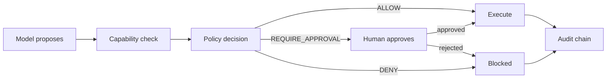

# Keelgate

**A safety-first agent harness for AI agents that touch money and regulated
actions.**

!!! quote "The design principle"
    The LLM proposes; deterministic code decides.

Large language models are good at proposing actions and bad at being a control.
Keelgate takes the proposal and puts a deterministic gate in front of anything
that writes: capability-scoped tools, policy-as-code risk gates, human
approvals, and a tamper-evident audit trail. A prompt is never a safety
boundary.

Keelgate **wraps** the frameworks you already use — LangGraph, the OpenAI Agents
SDK, the Claude Agent SDK, MCP, A2A. It does not compete with them.

## How a single action flows



Both outcomes are recorded. A blocked action is as much a fact worth keeping as
a successful one.

## Core capabilities

| Capability | Module | What it buys you |
|---|---|---|
| Capability-scoped tools | `keelgate.capabilities`, `keelgate.tools` | Nothing is callable that was not explicitly granted |
| Policy-as-code risk gates | `keelgate.policy` | OPA/Rego by default, Cedar optional, one interface |
| Durable budgeted loops | `keelgate.loop` | Bounded cost and steps, checkpointed, resumable |
| As-of-time context | `keelgate.context` | No lookahead and no leakage past the cutoff |
| Layered memory | `keelgate.memory` | Working, episodic, semantic, procedural |
| Human-in-the-loop approvals | `keelgate.approvals` | Approval is a state, not an exception path |
| Tamper-evident audit | `keelgate.audit` | Hash-chained, independently verifiable |
| Tracing | `keelgate.telemetry` | OpenTelemetry GenAI conventions |
| Evals and red-teaming | `keelgate.evals` | Including outcome-metric plugins |

## Safety posture

These are not defaults you can tune away; they are the point of the project.

1. **No live brokerage or real-money execution in v1.** Paper and simulation only.
2. **Every WRITE passes a deterministic policy gate.** Prompts are never a safety control.
3. **All external text is untrusted data** — tool output, web pages, documents, retrieved memory.
4. **Context and memory honour `as_of`.** Nothing published after the cutoff enters the context.
5. **Deny by default.** Explicit capability grants only, with tenant isolation everywhere.

The reasoning behind each is in the [security model](security-model.md).

## Project status

!!! warning "Phase K2 — the long-running agent"
    Capabilities, tools, policy, audit, approvals, the durable loop, context,
    memory, the LLM client, the framework adapters and the testing kit are
    implemented and tested. Telemetry and evals are not built yet. Read the
    [known gaps](security-model.md#known-gaps) before relying on it.

    Do not point a production workload at this.

## Getting started

```bash
git clone https://github.com/anilatambharii/keelgate.git
cd keelgate
make setup
make check
```

See the
[contributing guide](https://github.com/anilatambharii/keelgate/blob/main/CONTRIBUTING.md)
for the full workflow and the
[integration contract](integration-contract.md) if you are building on top of
Keelgate.

## Licensing

Everything outside `ee/` is Apache-2.0. The `ee/` directory holds Keelgate Cloud
and is proprietary. The boundary and the reasoning are recorded in
[ADR-0001](adr/0001-licensing-and-open-core.md).
