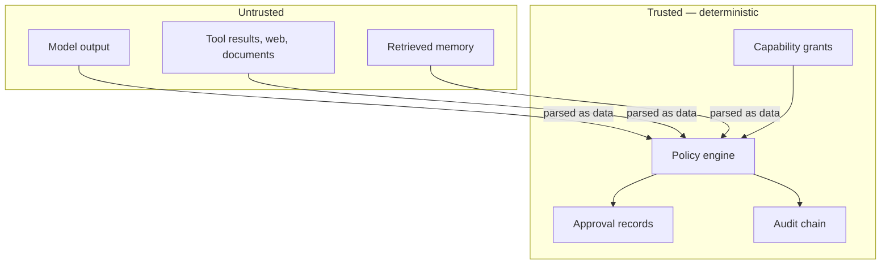

# Security model

!!! warning "Phase K0 — stub"
    This page states the intended model so that later phases can be measured
    against it. The enforcement it describes is **not implemented yet**. Where
    a control is still missing, it is marked *planned*.

## Assumptions

Keelgate is designed on four assumptions, and it is worth being blunt about
them:

1. **The model is untrusted.** Not malicious by default, but capable of being
   steered. Its output is a proposal, never an instruction to the harness.
2. **Tool output is untrusted.** Anything that comes back from a tool, a web
   page, a document or a memory lookup is attacker-influenceable data.
3. **The network is hostile.**
4. **Prompts are not a security boundary.** No amount of instruction hardening
   counts as a control. If a property matters, deterministic code enforces it.

## Trust boundaries

Everything on the left is data to be inspected. Nothing on the left can move the
boundary.

## The controls

### Deny by default

Absence of a grant is a denial, never an omission to be filled in by a default.
A tool with no matching `CapabilityGrant` is not callable, and a policy pack
that does not explicitly allow a request denies it.

### The policy gate

Every `SideEffect.WRITE` passes through `PolicyEngine` before execution. The
decision is a pure function of the request, the grants and the policy pack.
Model output can be an *input* to that function; it can never be the function.

Three outcomes: `ALLOW`, `DENY`, `REQUIRE_APPROVAL`. There is no fourth, and
there is no bypass flag.

### Untrusted text handling

*Planned.* External text is wrapped and passed as data, never spliced into a
position where it could be read as an instruction. Keelgate does not attempt to
"detect" prompt injection as its primary defence — detection is a mitigation,
the policy gate is the control.

### As-of-time discipline

Every read path carries an `as_of` timestamp, and any record whose publication
time is later is excluded. This is a correctness property as much as a security
one: it is what makes a replay or a backtest mean anything. It also prevents a
later-planted document from influencing an earlier decision under review.

### Tenant isolation

Every grant, record, memory entry and audit row is tenant-scoped. Cross-tenant
visibility is a vulnerability, not a configuration mistake.

### Human-in-the-loop

`REQUIRE_APPROVAL` suspends the run and emits an `ApprovalRequest`. The run
resumes only on a recorded human decision. Approval state lives in the audit
chain, so "who approved this and when" survives the process that asked.

### Tamper-evident audit

The audit log is append-only and hash-chained: each record commits to its
predecessor. `verify_chain()` is runnable by someone who does not trust whoever
wrote the log. Mutating or reordering records breaks verification.

### No real money in v1

There is no live brokerage or real-money execution path in v1 — paper and
simulation only. `KEELGATE_ALLOW_LIVE_EXECUTION` exists so the intent is
explicit and auditable, not as a switch that enables a hidden capability.

## Secrets

Secrets come from the environment, are never committed, and are kept out of
logs, spans, audit records and error messages. `.env` is gitignored,
`.env.example` documents every variable with an empty value, and CI runs secret
scanning on every push. Prompt and response content is excluded from telemetry
by default.

## What Keelgate does not protect against

Being clear about this matters more than sounding comprehensive:

- **A compromised host or database.** If an attacker holds the audit signing key
  or root on the machine, the audit chain tells you nothing you can trust.
- **A bad policy.** Keelgate enforces the pack you give it. A pack that allows
  too much is a correct enforcement of a wrong rule. Policies need review like
  code — because they are code.
- **Wrong-but-allowed actions.** An action within policy, within budget and
  approved by a human can still be a mistake. The audit chain is there to make
  it reconstructible.
- **Model quality.** Keelgate constrains consequences, not competence.

## Reporting

See
[SECURITY.md](https://github.com/anilatambharii/keelgate/blob/main/SECURITY.md).
Policy bypass, capability escalation, tenant leakage, `as_of` violations, audit
tampering and approval forgery are all in scope.
