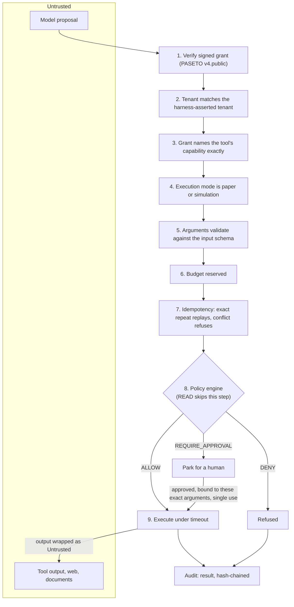

# Security model

This page states what Keelgate defends, against whom, how, and what it does **not**
yet defend. Where a control is implemented it links to the test that proves it.
Where it is missing it says so under [Known gaps](#known-gaps).

## Assumptions

1. **The model is untrusted.** Not malicious by default, but steerable. Its output
   is a *proposal*, never an instruction to the harness.
2. **Tool output is untrusted.** Anything returned by a tool, a web page, a document
   or a memory lookup can carry attacker-written text.
3. **Prompts are not a security boundary.** No instruction hardening counts as a
   control. If a property matters, deterministic code enforces it.
4. **The harness code and its configuration are trusted.** Keelgate enforces the
   policy pack, grants and limits it is given. It does not defend against a
   malicious operator or a malicious policy author.
5. **The host, the database and the signing key are trusted** to the extent that
   an attacker who holds them can defeat the audit chain (see the gaps).

## The decision path

Every gate fails closed, and **the audit record is written before the side
effect**. If the audit log cannot be written, nothing runs.

The policy engine's input is built by harness code. The model contributes only
the *arguments*, which are schema-validated and from which a tool-supplied
function derives the facts policy needs (`symbol`, `notional`). The model never
supplies the policy context (limits, exposure, mode, `as_of`).

## STRIDE

| # | Threat | Control | Evidence | Residual risk |
|---|---|---|---|---|
| **S**poofing | | | | |
| S1 | Forged or altered grant | PASETO `v4.public`; asymmetric, so verifiers cannot mint; purpose bound by an implicit assertion; `kid` cross-checked; lifetime capped even when correctly signed | `test_capabilities.py` (tamper, wrong key, cross-purpose, forged claims) | Bearer token: theft means use until expiry. No sender binding. |
| S2 | Stolen or replayed grant | Hard expiry (default max 24 h), `nbf`, revocation list | expiry boundary and revocation tests | Revocation list is **process-local** (gap G1) |
| S3 | Caller claims another tenant | Tenant must equal the grant's tenant, else `not_authorised`, nothing written to the other tenant | `test_a_grant_for_another_tenant_is_refused` | Trusts the harness to derive `tenant_id` from an authenticated session |
| S4 | Impersonating an approver | REST: bearer tokens, constant-time compare against all tokens; tenant comes from the token, never the request | `test_rest_*` | Static tokens are dev-grade; no SSO/MFA (gap G6) |
| S5 | Agent approves its own request | Separation of duties in the queue | `test_a_requester_cannot_approve_its_own_request` | A colluding human approver is out of scope |
| **T**ampering | | | | |
| T1 | Edit or reorder audit records | SHA-256 chain per tenant over exact payload text; append-only triggers; pure `verify_chain()` | `test_audit.py` tamper suite (edit, delete, reorder, splice, duplicate) | Someone with DDL rights can drop triggers and rewrite the **whole** chain (gap G2) |
| T2 | Truncate the audit tail | `head()` can be anchored externally; `verify_chain(expected_head=...)` detects removal and rewrite | anchor tests | Needs an anchor the writer cannot reach; not automated yet (gap G2) |
| T3 | Swap arguments after approval | Approval bound to `SHA-256(tool, canonical args)`; single use | `test_an_approval_cannot_authorise_different_arguments` | none known |
| T4 | Alter the policy | Every decision records the hash of the policy sources the engine actually has loaded | conformance test: disk hash equals the hash OPA reports | Does not stop a *bad* policy being deployed; needs review and signing |
| T5 | Poison the policy context via the model | Context is harness-supplied only; arguments cannot carry it | `test_prompt_injection.py` | Harness bugs that copy model data into context |
| T6 | Postgres JSONB reorders audit payloads | Payload stored as `TEXT`, hashed as the exact string | golden-vector and Postgres tests | none known |
| **R**epudiation | | | | |
| R1 | "The agent never did that" | `tool.call`, `policy.decision`, `tool.result` share a `call_id`; actor is the verified agent; written before the effect | `test_the_audit_record_exists_before_the_side_effect` | Args are logged unredacted (gap G7) |
| R2 | "I never approved that" | `approval.decided` records approver id, tier, args hash, evidence hash | `test_every_state_change_lands_in_the_audit_chain` | The CLI trusts the operator-supplied identity (gap G6) |
| **I**nformation disclosure | | | | |
| I1 | Probing the gate for internals | Fixed-wording errors; auth failures are indistinguishable (`Authorisation failed.`); capability names not revealed | `test_authorisation_failures_give_the_model_no_reason` | Policy reasons are shown to the model by design (see below) |
| I2 | Model text echoed into reasons | Pack rule: reasons never echo model-supplied strings | `test_reasons_never_echo_model_supplied_strings` (both engines) | A future pack author could break the rule; review item |
| I3 | Cross-tenant reads | Every query is tenant-scoped; another tenant's request is *not found*, not *forbidden* | `test_requests_are_invisible_across_tenants` | none known |
| I4 | Terminal escapes in evidence | Control characters stripped before display | `test_cli_strips_terminal_escapes_from_model_text` | A web UI must escape too; the REST API returns text as JSON |
| I5 | Secrets in logs | Tokens and keys hidden from `repr` | `test_token_and_private_key_do_not_leak_through_repr` | Exception text from tools is not returned to the model but is in process logs |
| **D**enial of service | | | | |
| D1 | Runaway cost | Per-grant budget; atomic reserve, released on any non-execution | `test_spend_never_exceeds_the_grant_budget` (property) | In-memory ledger (gap G1) |
| D2 | Oversized input | 64 KB argument cap; 256 KB audit payload cap; large outputs hashed, not stored | gateway hardening tests | No request-rate limiting (gap G8) |
| D3 | Policy engine down | Fails **closed**: every WRITE and PROPOSE is denied | `test_opa_unreachable_denies` | This is an availability cost by design |
| D4 | Hung tool | Per-tool timeout; a timed-out WRITE is parked `UNKNOWN`, never auto-retried | `test_a_timed_out_write_is_never_retried_automatically` | A synchronous tool's thread cannot be killed (gap G9) |
| D5 | Approval queue flooding | Requests expire; pending list is tenant-scoped | expiry tests | No per-agent rate limit (gap G8) |
| **E**levation of privilege | | | | |
| E1 | Capability escalation | Exact string match; **no wildcards**; empty grants refused | `test_wildcards_and_malformed_capabilities_are_rejected` | none known |
| E2 | Running a WRITE without a decision | One choke point; `Tool` refuses direct calls; registry frozen at gateway build; final "cleared" check | `test_properties.py`: hypothesis over arbitrary call sequences, plus mutation checks that disable each gate | In-process Python cannot truly seal a function (gap G3) |
| E3 | Live money movement | Refused at the gateway before policy; denied again by the pack; constructor rejects any non-paper mode | `test_live_mode_is_refused_before_policy_is_even_asked` | v1 has no live path at all |
| E4 | Engine divergence causing a fail-open | One conformance table runs through both Rego engines; Cedar adapter rejects any verdict with evaluation errors | conformance and Cedar tests | New edge cases need new rows |
| E5 | Replaying an approval | Single use; atomic compare-and-swap on status | `test_an_approval_can_be_spent_exactly_once` | none known |
| E6 | Reusing an idempotency key for a different action | Key bound to the argument hash; mismatch refused | `test_reusing_a_key_with_different_arguments_is_refused` | In-memory store (gap G1) |
| E7 | Prompt injection changing an authorisation outcome | Outcomes are a function of (grant, trusted context, arguments) only | `test_injected_text_cannot_change_the_outcome_of_any_candidate_action` | See "What injection can still do" |

## What prompt injection can still do

Keelgate does not stop a model being talked into *proposing* something. It makes
sure a bad proposal cannot be *executed* beyond what the grant and the policy
allow. Within those bounds an injected instruction can still:

- steer the agent toward an **allowed but poor** action (a legal trade the human
  would not have wanted). Limits, approval tiers and the audit trail bound and
  document that; they do not eliminate it.
- put misleading text in the **evidence** shown to an approver. The evidence is
  sanitised and clearly model-derived, but a human can still be persuaded. Treat
  the rationale as untrusted input to a person.
- waste budget up to the grant's ceiling.

## Fail-closed behaviour

Policy engines return a decision or, on **any** error, a DENY. This includes a
crashed engine, an unreachable OPA, malformed or unknown results, NaN or
non-JSON input, and a pack that defines no decision.

Two upstream behaviours were found while building this and are neutralised:

- **Cedar skips a policy that errors and can still return Allow.** If a `forbid`
  references a missing attribute, Cedar ignores it. The adapter rejects any
  verdict that carries evaluation errors.
- **`not x in set` does not deny when `x` is undefined** in Rego. The pack states
  every condition positively (`mode_ok`, `market_open`, `limits_ok`) and denies on
  `not <positive rule>`. A unit test pins the case that failed open in the first
  draft.

## Known gaps

These are known, accepted for K1, and listed so nobody assumes otherwise.

| # | Gap | Impact | Planned |
|---|---|---|---|
| G1 | Revocations, budgets and idempotency keys are **in-memory** | Wrong across processes or after a restart | Shared durable stores |
| G2 | The audit chain is not **externally anchored** automatically | A party who can rewrite the whole table undetectably forges history | Signed, periodically published heads |
| G3 | Python cannot hide a function body | Code in the same process that deliberately reaches into `Tool._fn` bypasses the gate | Out-of-process tool execution |
| G4 | Approvals are SQLite only | No shared approval queue across processes | Postgres backend |
| G5 | No key rotation tooling or HSM support | Operational burden | Cloud control plane |
| G6 | REST approver auth is a static token table; the CLI trusts the operator | Not production identity | OIDC/SSO in Cloud |
| G7 | Tool **arguments are written to the audit log unredacted** | Sensitive values could persist | Field-level redaction rules |
| G8 | No rate limiting on calls or approval requests | Abuse within budget | Gateway-level limits |
| G9 | A timed-out *synchronous* tool keeps running in its thread | Resource use; the effect may still land | Process isolation |
| G10 | The in-process Rego engine is a different implementation from OPA | Possible divergence | Conformance suite; use OPA in production |
| G11 | Cedar pack is a subset of `finance_basic` (no trading hours) | Feature gap | Port with precomputed time facts |

## Secrets

Secrets come from the environment and are never committed. `.env` is gitignored
and `.env.example` documents every variable with an empty value; a test fails the
build if a secret-shaped key has a value. CI runs gitleaks over full history and
detect-secrets against a baseline. The only credentials in the repository are the
deliberately weak localhost placeholders in `docker-compose.dev.yml`.

## Reporting

See [SECURITY.md](https://github.com/anilatambharii/keelgate/blob/main/SECURITY.md).
Policy bypass, capability escalation, tenant leakage, `as_of` violations, audit
tampering and approval forgery are all in scope.
